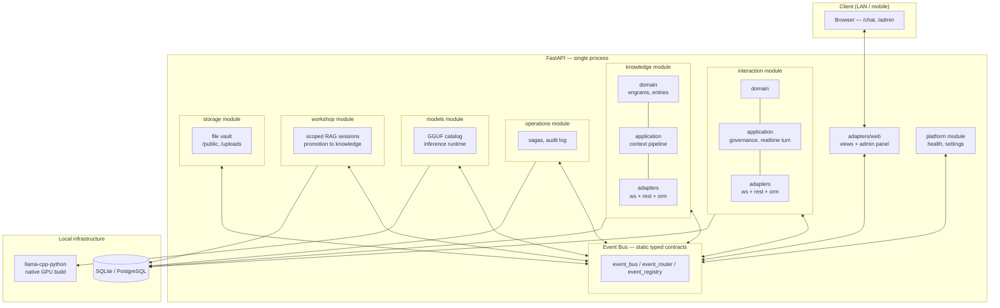

# RAG2 — Event-Driven Modular Monolith for Local Inference

A conversational chat system with context retrieval (RAG) that runs 100% self-hosted on consumer GPU hardware, reachable on the LAN from any device, with no dependency on any cloud inference provider.

---

## 1. The problem

Standard RAG pipelines retrieve text fragments by embedding similarity and inject them verbatim into the prompt. This has two well-known failure modes, both worse when the generation model runs locally and is bound by VRAM (there's no room to "just add more context" without hurting latency or running out of memory outright):

- **Context fragmentation**: the best-ranked chunk by similarity almost never contains the full answer — the rest of the relevant information sits in the previous or next chunk, which pure cosine similarity doesn't necessarily retrieve.
- **Rigid context budget**: with a local 12-24B model on 16GB of VRAM, every token of injected context directly competes with the space left for generation. Injecting more fragments "just in case" isn't free.

RAG2 attacks the first of these two problems with document expansion (see section 4) and explicitly separates retrieval, generation, and conversational identity logic into independent modules so each piece can iterate without dragging the rest along.

---

## 2. Architecture

Modular monolith: a single deployable process, but with module boundaries as strict as a microservice system — every module exposes its own `domain / application / adapters` layer and **never imports another module's internals directly**. All cross-module communication goes through an internal event bus (`event_bus`, `event_router`, `event_registry`) with statically typed event contracts, resolved at startup — no magic discovery, no implicit dependency injection: every module registers itself explicitly in the composition root (`app/bootstrap.py`).

**Why an event bus instead of direct calls between modules**: every module declares its inbound/outbound events as typed `EventSpec`s (`REQUEST_*`, `PUBLISH_*`) in its own `events.py`. A module never knows another module's implementation, only the event contract — this lets each module be tested with test doubles without spinning up the rest of the system (see `test/test_realtime_governance.py`, which exercises turn orchestration with a fake event bus) and makes any cross-domain dependency explicit in the code.

---

## 3. Tech stack

> Installation guide, environment variables, and route reference: [`docs/SETUP.md`](docs/SETUP.md). Feature deep dives: [`docs/FEATURES.md`](docs/FEATURES.md).

| Piece | Choice | Why |
|---|---|---|
| Backend | FastAPI + Uvicorn | Native async for the real-time chat WebSocket; explicit typing for routes and request/response models. |
| Persistence | SQLAlchemy 2.x, SQLite by default / optional PostgreSQL via `DATABASE_URL` | Database-agnostic layer in `app/core/database`; a homegrown additive migration mechanism (no Alembic) that inspects the existing schema with `inspect()` before altering tables, so already-deployed installs don't break. |
| Local inference | `llama-cpp-python` compiled with a native GPU backend per distro | See the dedicated section below — the piece with the most infrastructure engineering in the project. |
| Frontend | Vanilla JS served from the same FastAPI process (Jinja + `/ui-assets`) | No build step, no bundler, no Node dependency in production — consistent with the goal of a single-command LAN deployment. See the roadmap for the React migration. |
| Admin panel | Custom views under `/admin` | NestJS-style route tree visualizer, GGUF model catalog detected on disk, AI runtime diagnostics (text and vision smoke tests) without leaving the LAN. |
| Interchangeable inference backends | Local (`llama-cpp-python`), LM Studio, Ollama | Configurable via environment variable with no application code changes — the `models` module abstracts the provider behind a common port. |

### Local inference runtime: why `pip install llama-cpp-python` isn't enough

`llama-cpp-python` doesn't ship a GPU backend by default — the generic PyPI wheel is CPU-only. For AMD GPUs, each distro packages the ROCm stack differently, so a single install script doesn't work for both:

- **`installer-arch.sh`**: compiles with the native HIP backend (`-DGGML_HIP=ON`), because Arch's `rocm-hip-sdk` bundles hipBLAS/rocBLAS.
- **`installer-opensuse.sh`**: compiles with the Vulkan backend (`-DGGML_VULKAN=ON`), because openSUSE Tumbleweed doesn't package hipBLAS/rocBLAS — Vulkan performs comparably on RDNA3 without depending on ROCm's math libraries.

Both scripts detect the GPU target via `rocminfo` (or honor `AMD_GPU_TARGET` if exported manually), install the build toolchain and ROCm, and compile the dependency with the correct flags inside the project's own `.venv` — never in the system Python.

The real infrastructure problem they solve: `llama-cpp-python` is declared as a dependency with no build flags in `pyproject.toml`, so any `uv sync` (including the implicit one `uv run` does) silently reinstalls the CPU-only wheel and discards the compiled GPU backend — with no visible error, just much slower inference. The project solves this with a `run.sh` that always launches through the project's own `.venv` Python (never via `uv run`) and automatically recompiles if it detects the GPU backend's `.so` is missing.

---

## 4. Context retrieval system

Semantic retrieval by cosine similarity over the embeddings of each indexed fragment, with an optimization aimed at the fragmentation problem described in section 1:

**Parent Document Retrieval (small-to-big)**: when a relevant fragment comes from an ingested document, the system doesn't hand it over in isolation — it retrieves all sibling chunks from the same page of the source document and reconstructs them as a single, complete context block before injecting it into the prompt. This applies to the best distinct matches (not just the top one), deduplicating by page and splitting the character budget across the expansions so it doesn't crowd out the available generation space. Semantic search stays precise (it still matches against small fragments), but what reaches the model is the full page, not the loose fragment — avoiding the generic answer you get when the winning chunk cuts an idea in half.

**Per-turn traceability graph**: every query also builds a graph (`POST /api/knowledge/context/graph`) of nodes and edges — query, resolved identity, retrieved knowledge fragments, and referenced engrams, each edge carrying its relevance weight. This isn't the retrieval mechanism itself, but an audit layer: it lets you inspect exactly what influenced each response, also exposed in the admin panel. See [`docs/FEATURES.md`](docs/FEATURES.md) for the full node/edge model.

**Affective state and session memory**: each conversational identity (engram) keeps a PAD-style affective state vector (*Pleasure–Arousal–Dominance*) that updates with every interaction and is injected as explicit tone context on every generation call, plus a sliding-window session memory that summarizes incrementally without an extra model call per turn. See [`docs/FEATURES.md`](docs/FEATURES.md) for how the affective state is actually computed.

---

## 5. Configurable identity system (engrams)

Each "engram" is a configurable conversational behavior profile built from three conceptual layers:

1. **Generation layer**: the local model (or remote, if LM Studio/Ollama is configured) that produces the final text.
2. **Management and reasoning layer**: deterministic logic owned by the system itself — not another model — that decides the token budget based on turn complexity, routes the context query, applies behavior meta-rules (`meta_rule`, `behavior_prompt`), and runs a governance layer that validates *technical generation failures* (leaked internal reasoning tokens, instruction echo, output repetition/loops, malformed streaming artifacts) — deliberately without content-moderation heuristics.
3. **Vector memory layer**: the PAD affective state and the semantically retrieved knowledge fragments, both versioned per identity.

This separation keeps "personality" from being just a system-prompt string: tone is resolved by blending explicit per-identity rules with accumulated affective state, and output quality validation happens in a layer separate from generation itself. See [`docs/FEATURES.md`](docs/FEATURES.md) for the affective-state model in detail.

---

## 6. Development methodology

The system was built through an AI-agent-assisted development workflow with active author supervision, not unsupervised autonomous generation. In practice:

- **Explicit architectural constraints** were defined as input rules for the agent before any code generation: strict module boundaries (domain/application/adapters), communication exclusively through statically typed events, no cross-imports between domain modules.
- The work cycle was iterative: **autonomous build of a bounded fragment → manual review and correction → context reassimilation → repeat.** No fragment was integrated without human review of the resulting design against the declared constraints.
- Structural decisions — what counts as a module, where the boundary between `interaction` and `knowledge` sits, what's communicated by event versus resolved locally, when an abstraction is worth it versus over-engineering — were the author's direct responsibility at every iteration, not the agent's. The agent executed within constraints set by prior human decisions; it didn't define them.

---

## 7. Known limitations

- **Real semantic embeddings (resolved via Ollama)**: retrieval no longer depends solely on the fallback hash embedding — with `OLLAMA_EMBEDDING_MODEL` configured, `knowledge` calls the `/api/embed` endpoint of an already-running local Ollama instance to get real semantic vectors from whatever embedding model the user has pulled, with no need to install `sentence-transformers` or download separate weights (see `OllamaEmbeddingRuntime` in `app/knowledge/application/embedding_runtime.py`). If Ollama isn't available or `OLLAMA_EMBEDDING_MODEL` isn't configured, it automatically falls back to the local runtime (`sentence-transformers`) and, failing that, to the fallback hash — without breaking startup. Switching embedding runtimes requires re-indexing the existing corpus (`scripts/reembed_knowledge.py`), because the similarity score discards on dimension mismatch.
- **Retrieval without an ANN index**: cosine similarity is computed in pure Python over embeddings stored as a JSON column, with no approximate-nearest-neighbor index (neither `pgvector` nor FAISS wired into the ORM layer). Works fine at the current fragment volume, but retrieval cost grows linearly with the size of the knowledge base — it doesn't scale without changing the indexing strategy. With real embeddings already wired in (previous point), connecting `pgvector`'s ANN index is an explicit roadmap item (section 8) — at this project's data volume it wouldn't yield a measurable latency improvement, so it wasn't prioritized.
- **Parent Document expansion for the best matches (resolved)**: Parent Document Retrieval is no longer limited to the top-ranked fragment — it expands the full page of up to 2 relevant, mutually distinct matches, deduplicating by page (two chunks from the same page don't produce two blocks) and splitting the character budget across the real expansions so it doesn't crowd out the local model's generation space (see `_build_parent_document_matches` in `app/knowledge/application/context_pipeline.py`).
- **Real-token chunking (resolved)**: fragment size is no longer measured by word count — it's measured with the real tokenizer of a local GGUF model, loaded for its vocabulary only (`llama_cpp.Llama(..., vocab_only=True)`, no model weights, no network, independent of which backend is active for chat) — see `LocalTokenizerRuntime` in `app/knowledge/application/tokenizer_runtime.py`. If no `.gguf` is available in the environment, it falls back to word count (previous behavior) without breaking ingestion.
- **PostgreSQL with `pgvector` is provisioned at the infrastructure level (Docker image) but not wired in**: the current similarity engine doesn't use Postgres's native extension for indexed vector search; running with `DATABASE_URL` pointed at Postgres gives relational persistence, not retrieval acceleration yet. See section 8 — now that real semantic embeddings are in place, wiring up the ANN index is purely a scalability exercise, not a quality prerequisite.

---

## 8. Roadmap

- **Graph retrieval with hierarchical compression** (design already specified, implementation pending): community detection over the already-extracted entity graph, generating community summaries as higher-weight anchor nodes, and two-step retrieval (summary first, pointed detail only if needed) to address the context-scaling limit described in section 7.
- **Wire `pgvector` into the ORM layer** for indexed vector search in PostgreSQL, replacing the Python cosine calculation.
- **Dynamic compression threshold based on token budget** instead of a static criterion, once hierarchical compression is implemented.
- **Frontend migration to React**, keeping the same FastAPI backend and the already-supported bundle-mounting mechanism (`WEB_FRONTEND_MOUNT_PATH` / `WEB_FRONTEND_DIR`), with no need to rewrite the API layer.
