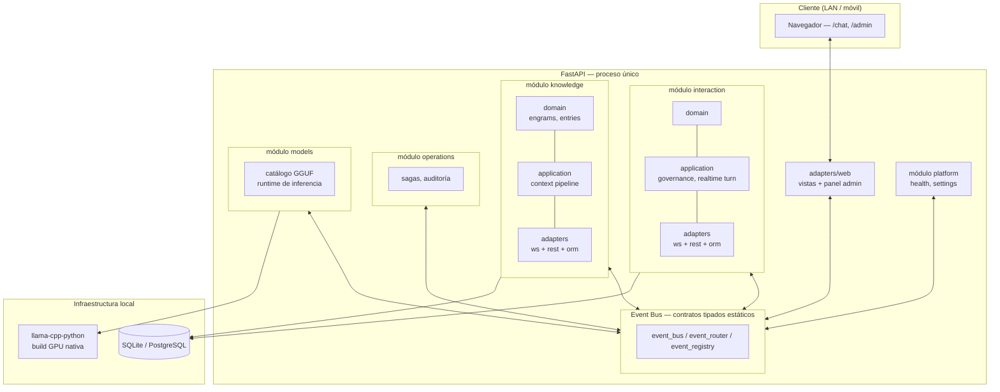

# RAG2 — Monolito Modular Event-Driven para Inferencia Local

Sistema de chat conversacional con recuperación de contexto (RAG) que corre 100% self-hosted sobre GPU de consumo, accesible en LAN desde cualquier dispositivo, sin depender de ningún proveedor de inferencia en la nube.

---

## 1. El problema

Los pipelines de RAG estándar recuperan fragmentos de texto por similitud de embeddings y los inyectan tal cual en el prompt. Esto tiene dos fallas conocidas, agravadas cuando el modelo de generación corre localmente y está limitado por VRAM (no hay margen para "meterle más contexto" sin degradar latencia o directamente quedarse sin memoria):

- **Fragmentación de contexto**: el chunk mejor rankeado por similitud casi nunca contiene la respuesta completa — el resto de la información relevante queda en el chunk anterior o siguiente, que la similitud de coseno pura no necesariamente recupera.
- **Presupuesto de contexto rígido**: con un modelo local de 12-24B en 16GB de VRAM, cada token de contexto inyectado compite directamente con el espacio para generación. Inyectar más fragmentos "por si acaso" no es gratis.

RAG2 ataca el primero de estos dos problemas con expansión de documento (ver sección 5) y separa explícitamente la lógica de recuperación, generación e identidad conversacional en módulos independientes para poder iterar cada pieza sin arrastrar al resto.

---

## 2. Arquitectura

Monolito modular: un solo proceso desplegable, pero con límites de módulo tan estrictos como en un sistema de microservicios — cada módulo expone su propia capa `domain / application / adapters` y **nunca importa código interno de otro módulo directamente**. Toda comunicación entre módulos pasa por un event bus interno (`event_bus`, `event_router`, `event_registry`) con contratos de evento tipados y estáticos, resueltos en tiempo de arranque — no hay descubrimiento mágico ni inyección de dependencias implícita: cada módulo se registra explícitamente en el composition root (`app/bootstrap.py`).

**Por qué event bus en vez de llamadas directas entre módulos**: cada módulo declara sus eventos de entrada/salida como `EventSpec` tipados (`REQUEST_*`, `PUBLISH_*`) en su propio `events.py`. Un módulo nunca conoce la implementación de otro, solo el contrato del evento — esto permite testear cada módulo con dobles de prueba sin levantar el resto del sistema (ver `test/test_realtime_governance.py`, que ejercita la orquestación de turno con un event bus falso) y hace explícita, en el código, cualquier dependencia cruzada entre dominios.

---

## 3. Stack técnico

> Guía de instalación, variables de entorno y referencia de rutas: [`docs/SETUP.md`](docs/SETUP.md).

| Pieza | Elección | Por qué |
|---|---|---|
| Backend | FastAPI + Uvicorn | Async nativo para WebSocket de chat en tiempo real; tipado explícito de rutas y modelos de request/response. |
| Persistencia | SQLAlchemy 2.x, SQLite por defecto / PostgreSQL opcional vía `DATABASE_URL` | Capa de base de datos agnóstica en `app/core/database`; migraciones aditivas propias (sin Alembic) que verifican el esquema existente con `inspect()` antes de alterar tablas, para no romper instalaciones ya desplegadas. |
| Inferencia local | `llama-cpp-python` compilado con backend GPU nativo por distro | Ver sección dedicada abajo — es la pieza con más ingeniería de infraestructura del proyecto. |
| Frontend | Vanilla JS servido desde el mismo proceso FastAPI (Jinja + `/ui-assets`) | Sin build step, sin bundler, sin dependencia de Node en producción — coherente con el objetivo de despliegue LAN de un solo comando. Ver roadmap para la migración a React. |
| Panel de administración | Vistas propias en `/admin` | Visualizador de rutas estilo árbol de módulos (inspirado en la vista de rutas de NestJS), catálogo de modelos GGUF detectados en disco, diagnóstico de runtime de IA (smoke test de texto y visión) sin salir de la LAN. |
| Backends de inferencia intercambiables | Local (`llama-cpp-python`), LM Studio, Ollama | Configurables por variable de entorno sin tocar código de aplicación — el módulo `models` abstrae el proveedor detrás de un puerto común. |

### Runtime de inferencia local: por qué no basta con `pip install llama-cpp-python`

`llama-cpp-python` no trae backend GPU por defecto — el wheel genérico de PyPI es CPU-only. Para GPU AMD, cada distro empaqueta el stack ROCm de forma distinta, así que un solo script de instalación no sirve para ambas:

- **`installer-arch.sh`**: compila con backend HIP nativo (`-DGGML_HIP=ON`), porque `rocm-hip-sdk` en Arch trae hipBLAS/rocBLAS empaquetados.
- **`installer-opensuse.sh`**: compila con backend Vulkan (`-DGGML_VULKAN=ON`), porque openSUSE Tumbleweed no empaqueta hipBLAS/rocBLAS — Vulkan rinde de forma comparable en RDNA3 sin depender de las librerías matemáticas de ROCm.

Ambos scripts detectan el target de GPU vía `rocminfo` (o respetan `AMD_GPU_TARGET` si se exporta manualmente), instalan el toolchain de compilación y ROCm, y compilan la dependencia con las flags correctas dentro del `.venv` del proyecto — nunca en el Python del sistema.

El problema de infraestructura real que resuelven: `llama-cpp-python` es una dependencia declarada sin flags de build en `pyproject.toml`, así que cualquier `uv sync` (incluido el implícito que corre `uv run`) reinstala silenciosamente el wheel CPU-only y descarta el backend GPU compilado — sin ningún error visible, solo inferencia mucho más lenta. El proyecto resuelve esto con un `run.sh` que arranca siempre a través del Python del propio `.venv` (nunca vía `uv run`) y recompila automáticamente si detecta que el `.so` del backend GPU falta.

---

## 4. Sistema de recuperación de contexto

Retrieval semántico por similitud de coseno sobre los embeddings de cada fragmento indexado, con una optimización dirigida al problema de fragmentación descrito en la sección 1:

**Parent Document Retrieval (small-to-big)**: cuando el fragmento mejor rankeado proviene de un documento ingerido, el sistema no lo entrega aislado — recupera todos los chunks hermanos de la misma página del documento origen y los reconstruye como un único bloque de contexto completo antes de inyectarlo en el prompt. La búsqueda semántica sigue siendo precisa (compara contra fragmentos pequeños), pero lo que llega al modelo es la página completa, no el fragmento suelto — evita la respuesta genérica que se obtiene cuando el chunk ganador corta la idea a la mitad.

**Grafo de trazabilidad por turno**: cada consulta construye además un grafo (`POST /api/knowledge/context/graph`) de nodos y aristas — consulta, identidad resuelta, fragmentos de conocimiento recuperados y engrams referenciados, cada arista con su peso de relevancia. No es el mecanismo de retrieval en sí, sino una capa de auditoría: permite inspeccionar exactamente qué influyó en cada respuesta, expuesta también en el panel de administración.

**Estado afectivo y memoria de sesión**: cada identidad conversacional (engram) mantiene un vector de estado afectivo tipo PAD (*Pleasure–Arousal–Dominance*) que se actualiza con cada interacción y se inyecta como contexto explícito de tono en cada llamada de generación, y una memoria de sesión de ventana deslizante que se resume incrementalmente sin depender de una nueva llamada al modelo por turno.

---

## 5. Sistema de identidades configurables (engrams)

Cada "engram" es un perfil de comportamiento conversacional configurable en tres capas conceptuales:

1. **Capa de generación**: el modelo local (o remoto, si se configura LM Studio/Ollama) que produce el texto final.
2. **Capa de gestión y razonamiento**: lógica determinista propia del sistema —no otro modelo— que decide presupuesto de tokens según la complejidad del turno, enruta la consulta de contexto, aplica metarreglas de comportamiento (`meta_rule`, `behavior_prompt`) y corre una capa de gobernanza que valida *fallas técnicas de la generación* (tokens de razonamiento interno filtrados, eco de instrucciones, repetición/loops de salida, artefactos de streaming mal cerrados) — deliberadamente sin heurísticas de moderación de contenido.
3. **Capa de memoria vectorial**: el estado afectivo PAD y los fragmentos de conocimiento recuperados semánticamente, ambos versionados por identidad.

Esta separación evita que "personalidad" sea solo un string de system prompt: el tono se resuelve mezclando reglas explícitas configuradas por identidad con el estado afectivo acumulado, y la validación de calidad de la salida ocurre en una capa separada de la generación misma.

---

## 6. Metodología de desarrollo

El sistema se construyó mediante un flujo de desarrollo asistido por agentes de IA con supervisión activa del autor, no generación autónoma sin control. En la práctica:

- Se definieron **restricciones arquitectónicas explícitas** como reglas de entrada para el agente antes de cualquier generación de código: límites estrictos de módulo (domain/application/adapters), comunicación exclusivamente por eventos estáticos tipados, prohibición de imports cruzados entre módulos de dominio.
- El ciclo de trabajo fue iterativo: **construcción autónoma de un fragmento acotado → revisión y corrección manual → reasimilación de contexto → repetir.** Ningún fragmento se integró sin pasar por revisión humana del diseño resultante contra las restricciones declaradas.
- Las decisiones estructurales — qué es un módulo, dónde va el límite entre `interaction` y `knowledge`, qué se comunica por evento y qué se resuelve localmente, cuándo una abstracción vale la pena y cuándo es sobre-ingeniería — fueron responsabilidad directa del autor en cada iteración, no del agente. El agente ejecutó dentro de restricciones fijadas por decisión humana previa, no las definió.

---

## 7. Limitaciones conocidas

- **Retrieval sin índice ANN**: la similitud de coseno se calcula en Python puro sobre embeddings guardados como columna JSON, sin índice de vecinos aproximados (ni `pgvector` ni FAISS conectados a la capa de ORM). Funciona bien en el rango de fragmentos actual, pero el costo de retrieval crece linealmente con el tamaño de la base de conocimiento — no escala sin cambiar la estrategia de indexado.
- **Expansión a documento padre limitada al primer match**: el Parent Document Retrieval solo se aplica al fragmento mejor rankeado de la consulta. Si la información relevante está repartida entre el segundo y tercer match, esos siguen inyectándose como fragmentos aislados sin expansión.
- **Chunking por palabras, no por tokens**: el tamaño de fragmento se define por conteo de palabras con empaquetado por oración completa, no por conteo exacto de tokens del tokenizer del modelo — el presupuesto real de contexto varía según el idioma y la densidad léxica del texto ingerido.
- **PostgreSQL con `pgvector` está provisto a nivel de infraestructura (imagen Docker) pero no conectado**: el motor de similitud actual no usa la extensión nativa de Postgres para búsqueda vectorial indexada; correr con `DATABASE_URL` apuntando a Postgres da persistencia relacional, no aceleración de retrieval todavía.

---

## 8. Roadmap

- **Retrieval por grafo con compresión jerárquica** (diseño ya especificado, pendiente de implementación): detección de comunidades sobre el grafo de entidades ya extraído, generación de resúmenes de comunidad como nodos-ancla de mayor peso, y retrieval en dos pasos (resumen primero, detalle puntual solo si se necesita) para resolver el límite de escalado de contexto descrito en la sección 7.
- **Conectar `pgvector` a la capa de ORM** para búsqueda vectorial indexada en PostgreSQL, reemplazando el cálculo de coseno en Python.
- **Umbral de compresión dinámico por presupuesto de tokens** en vez de un criterio estático, una vez implementada la compresión jerárquica.
- **Migración del frontend a React**, manteniendo el mismo backend FastAPI y el mecanismo de montaje de bundles ya soportado (`WEB_FRONTEND_MOUNT_PATH` / `WEB_FRONTEND_DIR`), sin necesidad de reescribir la capa de API.
